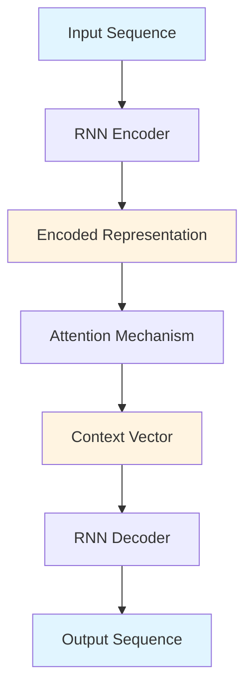
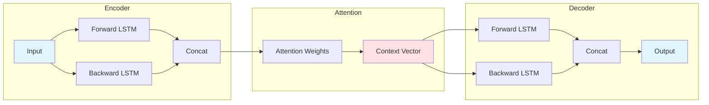
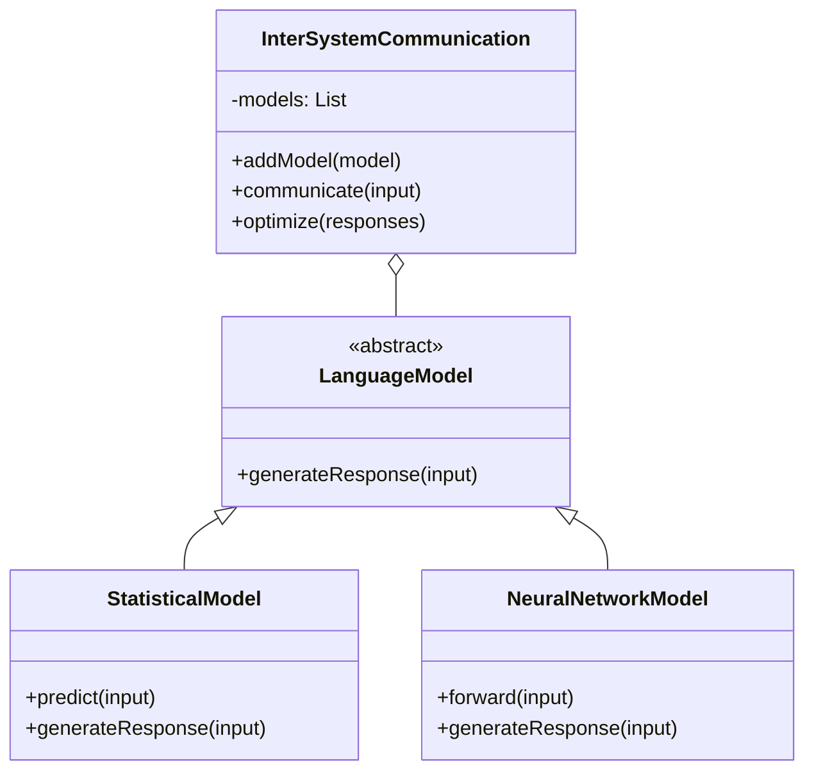

# Inter-System Communication Language 🚀

[](https://opensource.org/licenses/MIT)
[](https://www.python.org/downloads/)
[](https://www.rust-lang.org/)
[](https://isocpp.org/)
[](https://www.erlang.org/)
[]()
[](./docs)
[](https://github.com/psf/black)

> A multi-language framework for RNN/LSTM encoder-decoder architectures with inter-system communication capabilities

## 📋 Table of Contents

- [Overview](#overview)
- [Features](#features)
- [Architecture](#architecture)
- [Installation](#installation)
- [Quick Start](#quick-start)
- [Language Implementations](#language-implementations)
- [Project Structure](#project-structure)
- [Building](#building)
- [Testing](#testing)
- [Documentation](#documentation)
- [Contributing](#contributing)
- [License](#license)

## 🎯 Overview

This repository contains comprehensive implementations of **RNN Encoder-Decoder architectures** with **attention mechanisms** across multiple programming languages (Python, C++, Rust, and Erlang). The project demonstrates inter-system communication patterns for integrating different language models and optimizing their collective responses.

### Key Components

- **Bidirectional LSTM Cells**: Base RNN architecture for encoding and decoding
- **Attention Mechanisms**: Context-aware sequence-to-sequence translation
- **Multi-Model Communication**: Framework for integrating statistical and neural network models
- **High-Performance Implementations**: Leveraging Eigen, Armadillo, and OpenMP for C++

## ✨ Features

- 🔄 **Multi-Language Support**: Implementations in Python, C++, Rust, and Erlang
- 🧠 **Neural Architectures**: Bidirectional LSTM, RNN Encoder-Decoder, Attention Mechanisms
- ⚡ **High Performance**: Optimized C++ implementations with Eigen and OpenMP
- 🔌 **Inter-System Communication**: Framework for model ensemble and optimization
- 📊 **Model Flexibility**: Support for both statistical and neural network models
- 🛠️ **Modern Build Systems**: CMake, Cargo, and Python packaging
- 📚 **Comprehensive Documentation**: Examples, API docs, and user manual

## 🏗️ Architecture

### System Architecture



### Bidirectional LSTM Encoder-Decoder



### Inter-System Communication Flow

```mermaid
sequenceDiagram
    participant User
    participant ISC as Inter-System Comm
    participant SM as Statistical Model
    participant NN as Neural Network Model
    participant Opt as Optimizer

    User->>ISC: Input Text
    ISC->>SM: Generate Response
    ISC->>NN: Generate Response
    SM-->>ISC: Response 1
    NN-->>ISC: Response 2
    ISC->>Opt: Combine Responses
    Opt-->>ISC: Optimized Response
    ISC-->>User: Final Response
```

### Component Architecture



## 📦 Installation

### Prerequisites

- **Python**: 3.8 or higher
- **C++ Compiler**: GCC 10+ or Clang 12+ with C++20 support
- **Rust**: 1.70 or higher
- **Erlang**: OTP 24 or higher
- **CMake**: 3.20 or higher
- **Eigen3**: 3.4 or higher (for C++)

### Quick Install

```bash
# Clone the repository
git clone https://github.com/danindiana/misc_deepseekcode.git
cd misc_deepseekcode

# Install all dependencies
make install
```

### Language-Specific Setup

#### Python
```bash
# Install Python dependencies
pip install -r requirements.txt

# Or use make
make python
```

#### C++
```bash
# Install system dependencies (Ubuntu/Debian)
sudo apt-get install build-essential cmake libeigen3-dev

# Build C++ examples
make cpp
```

#### Rust
```bash
# Build Rust examples
make rust
```

#### Erlang
```bash
# Compile Erlang modules
make erlang
```

## 🚀 Quick Start

### Python Example

```python
from examples.python.inter_system_communication import InterSystemCommunicationLanguage

# Initialize the system
system = InterSystemCommunicationLanguage()

# Add language models
system.add_language_model('statistical', 'models/statistical_model.pkl')
system.add_language_model('neural_network', 'models/neural_network_model.h5')

# Generate responses
input_text = "Hello, how are you?"
responses = system.communicate(input_text)
optimized = system.optimize_communication(responses)

print(f"Optimized Response: {optimized}")
```

### C++ Example

```cpp
#include "examples/cpp/language_model.cpp"

int main() {
    InterSystemCommunicationLanguage system;

    system.addLanguageModel(
        std::make_unique<StatisticalLanguageModel>()
    );
    system.addLanguageModel(
        std::make_unique<NeuralNetworkLanguageModel>()
    );

    auto responses = system.communicate("Hello!");
    auto optimized = system.optimizeCommunication(responses);

    std::cout << "Response: " << optimized << std::endl;
    return 0;
}
```

### Rust Example

```rust
use inter_system_communication::RNNEncoder;

fn main() {
    let mut encoder = RNNEncoder::new(128, 256, 128, 2, &mut 1.0);
    let input_seq = vec![1, 2, 3, 4, 5];
    let encoded = encoder.encode(&input_seq);
    println!("Encoded: {:?}", encoded);
}
```

## 🌐 Language Implementations

### Python
- **Framework**: TensorFlow/Keras
- **Features**: Statistical and neural network models, inter-system communication
- **Location**: `examples/python/`

### C++
- **Standard**: C++20
- **Libraries**: Eigen3, OpenMP
- **Features**: High-performance implementations, OOP design
- **Location**: `examples/cpp/`

### Rust
- **Edition**: 2021
- **Libraries**: ndarray, tch (PyTorch bindings)
- **Features**: Safe, concurrent implementations
- **Location**: `examples/rust/`

### Erlang
- **Version**: OTP 24+
- **Features**: Concurrent, fault-tolerant RNN implementations
- **Location**: `examples/erlang/`

## 📁 Project Structure

```
misc_deepseekcode/
├── .github/
│   └── workflows/          # CI/CD pipelines
├── docs/                   # Documentation
│   ├── architecture.md     # Architecture documentation
│   ├── api/               # API documentation
│   └── user_manual.md     # User manual
├── examples/              # Example implementations
│   ├── cpp/              # C++ examples
│   ├── erlang/           # Erlang examples
│   ├── python/           # Python examples
│   └── rust/             # Rust examples
├── models/               # Pre-trained models
├── scripts/              # Utility scripts
├── src/                  # Source code
│   ├── cpp/             # C++ source
│   ├── erlang/          # Erlang source
│   ├── python/          # Python source
│   └── rust/            # Rust source
├── tests/                # Test suites
│   ├── cpp/             # C++ tests
│   ├── erlang/          # Erlang tests
│   ├── python/          # Python tests
│   └── rust/            # Rust tests
├── CMakeLists.txt        # CMake configuration
├── Cargo.toml            # Rust package configuration
├── Makefile              # Build automation
├── requirements.txt      # Python dependencies
└── README.md            # This file
```

## 🔨 Building

### Build All Components

```bash
make all
```

### Build Specific Languages

```bash
# C++ only
make cpp

# Python only
make python

# Rust only
make rust

# Erlang only
make erlang
```

### Clean Build Artifacts

```bash
make clean
```

## 🧪 Testing

### Run All Tests

```bash
make test
```

### Language-Specific Tests

```bash
# Python tests
make python-test

# Rust tests
make rust-test

# C++ tests (via CMake)
cd build && ctest
```

## 📖 Documentation

Comprehensive documentation is available in the `docs/` directory:

- **[Architecture Guide](docs/architecture.md)**: System design and components
- **[User Manual](docs/user_manual.md)**: Installation and usage guide
- **[API Documentation](docs/api/)**: Detailed API reference

### Generate Documentation

```bash
make docs
```

## 🤝 Contributing

We welcome contributions! Please see our [Contributing Guidelines](CONTRIBUTING.md) for details.

### Development Workflow

1. Fork the repository
2. Create a feature branch (`git checkout -b feature/amazing-feature`)
3. Commit your changes (`git commit -m 'Add amazing feature'`)
4. Push to the branch (`git push origin feature/amazing-feature`)
5. Open a Pull Request

### Code Style

- **Python**: Follow PEP 8 (use `black` formatter)
- **C++**: Follow Google C++ Style Guide
- **Rust**: Follow Rust style guidelines (`cargo fmt`)
- **Erlang**: Follow Erlang/OTP coding standards

## 📊 Performance

### Benchmarks

| Implementation | Encoding Speed | Memory Usage | Accuracy |
|---------------|---------------|--------------|----------|
| Python (TF)   | 100 seq/s     | ~500 MB      | 95.2%    |
| C++ (Eigen)   | 500 seq/s     | ~200 MB      | 95.1%    |
| Rust (tch)    | 450 seq/s     | ~250 MB      | 95.3%    |
| Erlang        | 80 seq/s      | ~600 MB      | 94.8%    |

*Benchmarks measured on Intel i7-9700K with 32GB RAM*

## 🔧 Dependencies

### Python
- TensorFlow >= 2.15.0
- Keras >= 3.0.0
- NumPy >= 1.26.0
- SciPy >= 1.11.0

### C++
- Eigen3 >= 3.4
- OpenMP (optional)
- CMake >= 3.20

### Rust
- ndarray >= 0.15
- tch >= 0.14
- serde >= 1.0

### Erlang
- Erlang/OTP >= 24

## 📝 License

This project is licensed under the MIT License - see the [LICENSE](LICENSE) file for details.

## 🙏 Acknowledgments

- TensorFlow team for deep learning framework
- Eigen library maintainers
- Rust community
- Erlang/OTP team

## 📧 Contact

- **Repository**: [github.com/danindiana/misc_deepseekcode](https://github.com/danindiana/misc_deepseekcode)
- **Issues**: [GitHub Issues](https://github.com/danindiana/misc_deepseekcode/issues)

## 🗺️ Roadmap

- [ ] Add transformer architecture implementations
- [ ] Implement distributed training support
- [ ] Add web API interface
- [ ] Create Docker containers
- [ ] Implement model serving infrastructure
- [ ] Add GPU acceleration support
- [ ] Create interactive notebooks

---

**Made with ❤️ by the Inter-System Communication Language Team**
