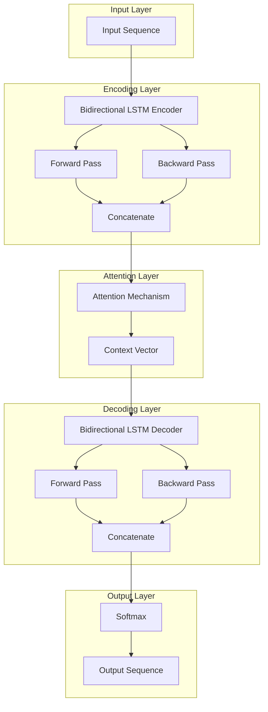
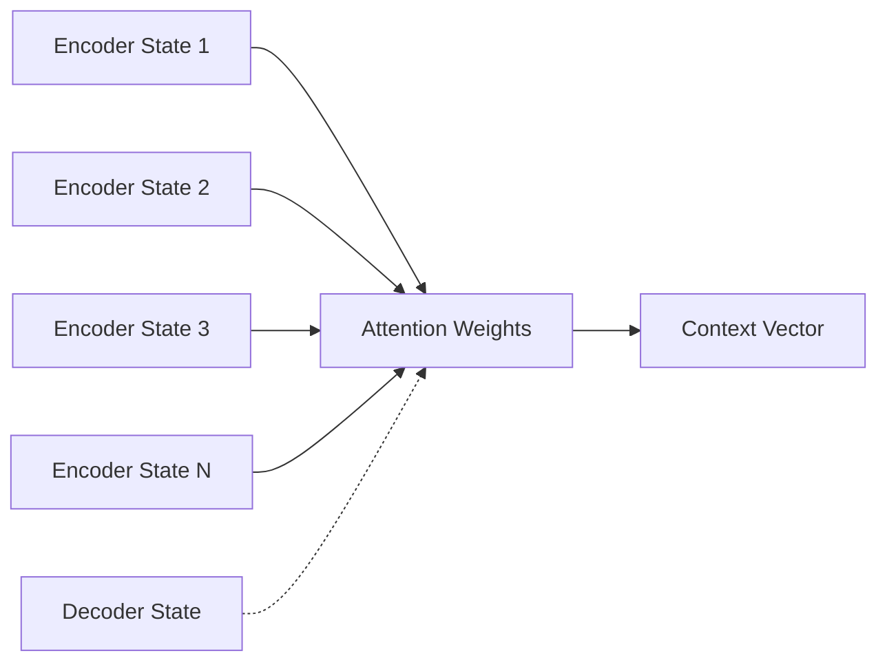
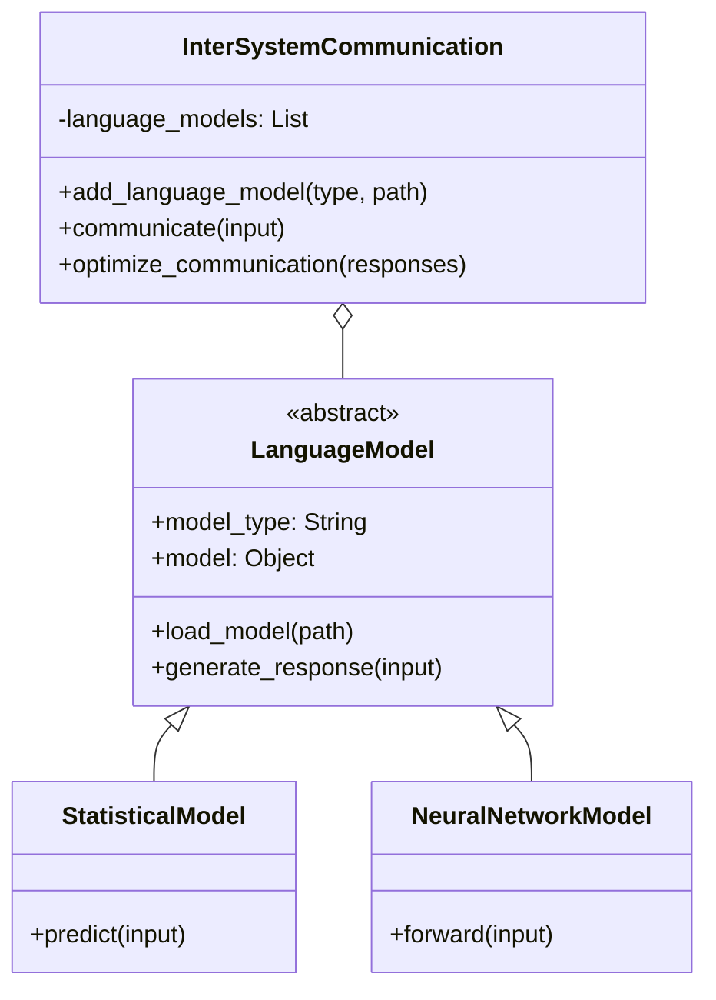
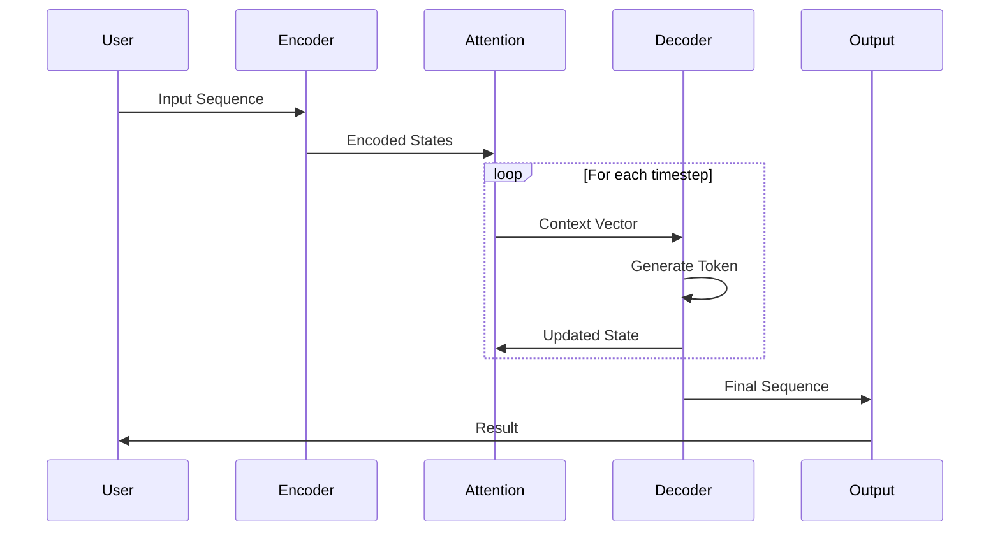
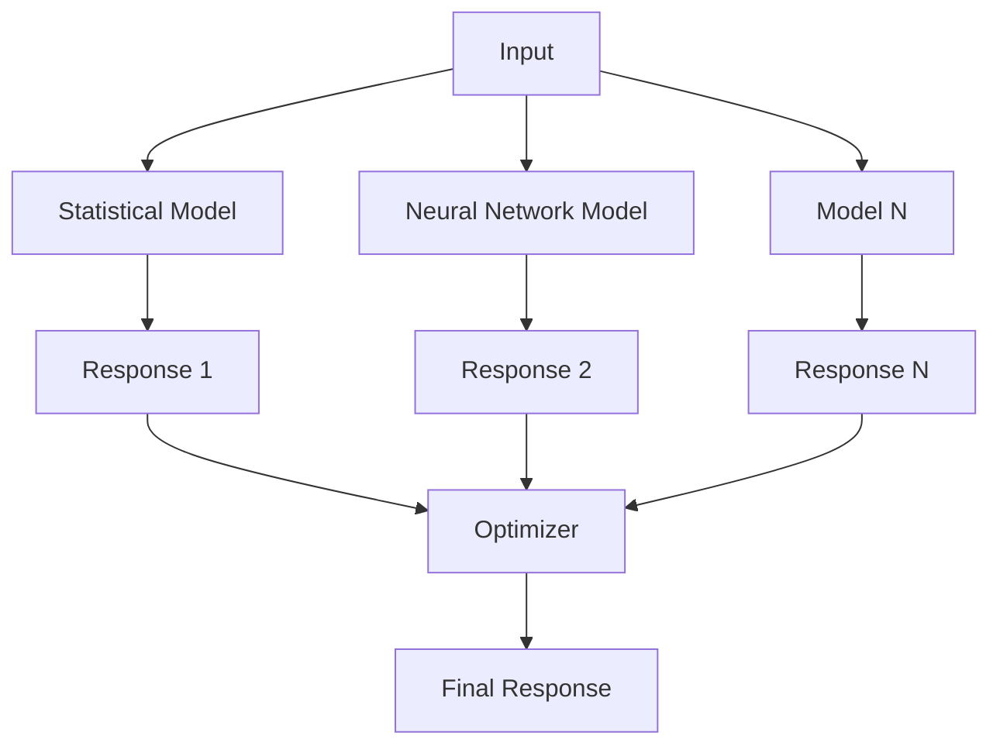

# Architecture Documentation

## Overview

The Inter-System Communication Language project implements RNN/LSTM encoder-decoder architectures across multiple programming languages, demonstrating how different language models can communicate and collaborate effectively.

## System Architecture

### High-Level Design



## Component Details

### 1. RNN Encoder

The encoder transforms input sequences into fixed-length vector representations.

**Key Features:**
- Bidirectional LSTM cells for capturing context in both directions
- Embedding layer for token representation
- Variable-length input sequence support

**Implementation Highlights:**

```python
# Python pseudocode
encoded_vectors = []
for symbol in input_sequence:
    forward_state = forward_lstm(symbol)
    backward_state = backward_lstm(symbol)
    encoded_vector = concatenate(forward_state, backward_state)
    encoded_vectors.append(encoded_vector)
```

### 2. Attention Mechanism

Attention allows the decoder to focus on relevant parts of the input sequence at each decoding step.

**Attention Computation:**

```
attention_weights = softmax(score(decoder_state, encoder_states))
context_vector = sum(attention_weights * encoder_states)
```

**Visualization:**



### 3. RNN Decoder

The decoder generates output sequences from encoded representations.

**Key Features:**
- Context-aware generation using attention
- Bidirectional LSTM cells
- Probability distribution over vocabulary at each timestep

### 4. Inter-System Communication Framework

Enables multiple models to collaborate on tasks.



## Language-Specific Implementations

### Python Implementation

**Architecture:**
- Framework: TensorFlow/Keras
- Design Pattern: Object-Oriented
- Key Classes:
  - `LanguageModel`: Base class for all models
  - `InterSystemCommunicationLanguage`: Orchestrator class

**Strengths:**
- Rich ecosystem of ML libraries
- Easy prototyping and experimentation
- Extensive documentation

### C++ Implementation

**Architecture:**
- Standard: C++20
- Libraries: Eigen3, OpenMP
- Design Pattern: Abstract Base Classes with Virtual Functions

**Strengths:**
- High performance
- Low memory footprint
- Fine-grained control over resources

**Performance Optimizations:**
- Eigen for SIMD-optimized linear algebra
- OpenMP for parallel processing
- Move semantics for efficient memory management

### Rust Implementation

**Architecture:**
- Edition: 2021
- Libraries: ndarray, tch (PyTorch bindings)
- Design Pattern: Trait-based polymorphism

**Strengths:**
- Memory safety without garbage collection
- Zero-cost abstractions
- Excellent concurrency support

### Erlang Implementation

**Architecture:**
- OTP Version: 24+
- Design Pattern: Actor model with message passing

**Strengths:**
- Fault tolerance
- Concurrent execution
- Hot code reloading

## Data Flow

### Training Phase

```mermaid
sequenceDiagram
    participant Data as Training Data
    participant Enc as Encoder
    participant Att as Attention
    participant Dec as Decoder
    participant Loss as Loss Function
    participant Opt as Optimizer

    Data->>Enc: Input Sequence
    Enc->>Att: Encoded States
    Data->>Dec: Target Sequence
    Att->>Dec: Context Vectors
    Dec->>Loss: Predictions
    Data->>Loss: Ground Truth
    Loss->>Opt: Gradients
    Opt->>Enc: Update Weights
    Opt->>Dec: Update Weights
```

### Inference Phase



## Multi-Model Collaboration

### Ensemble Strategy



**Optimization Strategies:**
1. **Ensemble Averaging**: Simple average of all model outputs
2. **Weighted Voting**: Weight responses by model confidence
3. **Stacking**: Use a meta-model to combine responses
4. **Boosting**: Sequential model improvement

## Memory Management

### Python
- Automatic garbage collection
- TensorFlow manages GPU memory
- Batch processing for large datasets

### C++
- RAII (Resource Acquisition Is Initialization)
- Smart pointers (unique_ptr, shared_ptr)
- Manual memory pool management for critical paths

### Rust
- Ownership system prevents memory leaks
- Borrowing for temporary access
- Arc/Rc for shared ownership

### Erlang
- Per-process garbage collection
- Copy-on-write for message passing
- Automatic memory reclamation

## Scalability Considerations

### Horizontal Scaling
- Model parallelism across multiple instances
- Data parallelism for batch processing
- Load balancing for request distribution

### Vertical Scaling
- Multi-threading (OpenMP in C++)
- SIMD instructions (Eigen)
- GPU acceleration (TensorFlow, PyTorch)

## Security Considerations

1. **Input Validation**: Sanitize all user inputs
2. **Model Isolation**: Sandbox model execution
3. **Access Control**: Authenticate API requests
4. **Data Privacy**: Encrypt sensitive data
5. **Audit Logging**: Track all system operations

## Performance Metrics

### Latency
- Encoding time per sequence
- Decoding time per token
- End-to-end inference time

### Throughput
- Sequences processed per second
- Tokens generated per second
- Batch processing capacity

### Resource Usage
- CPU utilization
- Memory consumption
- GPU memory (if applicable)
- Network bandwidth (for distributed systems)

## Future Enhancements

1. **Transformer Architecture**: Implement self-attention mechanisms
2. **Distributed Training**: Multi-node training support
3. **Model Compression**: Quantization and pruning
4. **Streaming Inference**: Real-time processing
5. **Multi-Modal Support**: Text, image, and audio inputs

## References

- [Attention Is All You Need (Vaswani et al., 2017)](https://arxiv.org/abs/1706.03762)
- [Sequence to Sequence Learning (Sutskever et al., 2014)](https://arxiv.org/abs/1409.3215)
- [Neural Machine Translation by Jointly Learning to Align and Translate (Bahdanau et al., 2014)](https://arxiv.org/abs/1409.0473)
